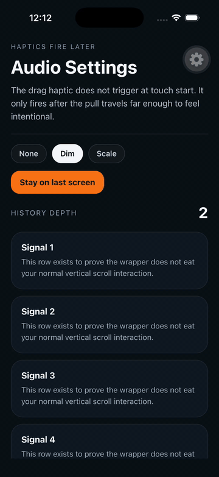

# expo-edge-back

Predictive edge-swipe back interaction for Expo and bare React Native.

The component stays invisible until the user starts dragging from the screen edge, then reveals a predictive back anchor inspired by the Nothing Phone 3a style of visual feedback.

## Features

- TypeScript-first API
- Works with Expo and bare React Native
- Hidden anchor that only appears after an edge drag begins
- Left edge, right edge, or both edges
- Optional content dimming or scale-down while dragging
- Custom anchor rendering with access to Reanimated shared values
- Custom overlay rendering, useful for touch indicators in demos
- Navigation-agnostic core API via `onBack()`
- Android support can be explicitly enabled when system back gestures are not available

## Installation

Install the package and its required peers:

```sh
npm install expo-edge-back react-native-gesture-handler react-native-reanimated react-native-svg
```

Expo example:

```sh
npx expo install react-native-gesture-handler react-native-reanimated react-native-svg
npm install expo-edge-back
```

If you want haptics, install them in your app and pass callbacks:

```sh
npx expo install expo-haptics
```

## Setup

For bare React Native, make sure Reanimated is configured in your Babel config:

```js
module.exports = {
  plugins: ['react-native-reanimated/plugin'],
};
```

For Expo SDK 55+, `babel-preset-expo` already handles the Reanimated plugin in Expo apps.

Import `react-native-gesture-handler` at the app entrypoint and use `GestureHandlerRootView` near the root.

## Usage

```tsx
import 'react-native-gesture-handler';

import { GestureHandlerRootView } from 'react-native-gesture-handler';
import { EdgeBackGestureView } from 'expo-edge-back';

export function Screen() {
  return (
    <GestureHandlerRootView style={{ flex: 1 }}>
      <EdgeBackGestureView
        onBack={() => {
          // navigation.goBack() or router.back()
        }}
        edge="both"
        contentEffect="dim"
      >
        {/* screen content */}
      </EdgeBackGestureView>
    </GestureHandlerRootView>
  );
}
```

## React Navigation / Expo Router

The package does not depend on navigation libraries. Pass your own callback:

```tsx
import { useRouter } from 'expo-router';

const router = useRouter();

<EdgeBackGestureView onBack={() => router.back()} />;
```

```tsx
<EdgeBackGestureView onBack={() => navigation.goBack()} />
```

If your navigator already owns the left-edge gesture and that conflicts with your screen, disable the navigator gesture for that screen and let this component own the interaction.

## Haptics

The library is callback-based so it works in bare React Native without forcing `expo-haptics` into the package itself.

```tsx
import * as Haptics from 'expo-haptics';

<EdgeBackGestureView
  onBack={() => navigation.goBack()}
  onDragHaptic={() => {
    void Haptics.selectionAsync();
  }}
  onReleaseHaptic={(didTrigger) => {
    if (didTrigger) {
      void Haptics.impactAsync(Haptics.ImpactFeedbackStyle.Light);
    }
  }}
/>;
```

The drag haptic is intended as an early edge-gesture confirmation, so it fires when the anchor first reveals rather than near the commit point.

## Custom Anchor

Provide `renderAnchor` to draw your own predictive back indicator. The render callback receives Reanimated shared values.

```tsx
import {
  EdgeBackGestureView,
  type EdgeBackAnchorRenderProps,
} from 'expo-edge-back';

function MyAnchor({ progress }: EdgeBackAnchorRenderProps) {
  return <CustomAnchor progress={progress} />;
}

<EdgeBackGestureView
  onBack={() => navigation.goBack()}
  renderAnchor={(props) => <MyAnchor {...props} />}
/>;
```

## Custom Overlay

Provide `renderOverlay` if you need a drag-following overlay such as a recording touch indicator.

```tsx
import Animated, { useAnimatedStyle } from 'react-native-reanimated';

function TouchOverlay({ isVisible, touchX, touchY }) {
  const style = useAnimatedStyle(() => ({
    opacity: isVisible.value,
    transform: [
      { translateX: touchX.value - 14 },
      { translateY: touchY.value - 14 },
    ],
  }));

  return <Animated.View pointerEvents="none" style={style} />;
}

<EdgeBackGestureView
  onBack={() => navigation.goBack()}
  renderOverlay={(props) => <TouchOverlay {...props} />}
/>;
```

## Props

| Prop                    | Type                            | Default                     | Notes                                                           |
| ----------------------- | ------------------------------- | --------------------------- | --------------------------------------------------------------- |
| `onBack`                | `() => void`                    | required                    | Called after a successful release past the activation threshold |
| `enabled`               | `boolean`                       | `true`                      | Master enable switch                                            |
| `enabledOnAndroid`      | `boolean`                       | `false`                     | Opt in on Android                                               |
| `edge`                  | `'left' \| 'right' \| 'both'`   | `'both'`                    | Which screen edge can trigger the gesture                       |
| `edgeWidth`             | `number`                        | `24`                        | Edge activation width                                           |
| `revealDistance`        | `number`                        | `96`                        | Distance used to complete the anchor reveal                     |
| `activationDistance`    | `number`                        | `132`                       | Release threshold for `onBack`                                  |
| `dragHapticDistance`    | `number`                        | `14`                        | Distance before drag haptic fires                               |
| `maxDragDistance`       | `number`                        | `180`                       | Clamp for drag distance                                         |
| `anchorSize`            | `number`                        | `56`                        | Default anchor size                                             |
| `anchorColor`           | `string`                        | `#f8f8f5`                   | Arrow color                                                     |
| `anchorBackgroundColor` | `string`                        | `#111111`                   | Anchor fill color                                               |
| `contentEffect`         | `'none' \| 'dim' \| 'scale'`    | `'none'`                    | Mid-drag screen effect                                          |
| `contentScaleTo`        | `number`                        | `0.97`                      | Scale target when `contentEffect="scale"`                       |
| `dimMaxOpacity`         | `number`                        | `0.12`                      | Max overlay opacity when `contentEffect="dim"`                  |
| `onDragHaptic`          | `() => void`                    | optional                    | Called once when the drag reaches the haptic threshold          |
| `onReleaseHaptic`       | `(didTrigger: boolean) => void` | optional                    | Called on release                                               |
| `renderAnchor`          | `(props) => ReactNode`          | optional                    | Custom anchor renderer                                          |
| `renderOverlay`         | `(props) => ReactNode`          | optional                    | Custom overlay renderer                                         |

## Testing

This repo includes unit tests for the pure drag-threshold helpers. Gesture behavior itself is best verified in the example app on device or simulator.

## Example



The example app currently demonstrates:

- left and right edge predictive back
- custom morphing anchor
- optional dim/scale content effects
- early drag haptics
- a recording-friendly touch indicator overlay

Run the demo app from the workspace:

```sh
yarn
cd example
npx expo run:ios
npx expo start --dev-client
```

Use the installed development build on the simulator or device, not Expo Go.

## Contributing

- [Development workflow](./CONTRIBUTING.md#development-workflow)
- [Sending a pull request](./CONTRIBUTING.md#sending-a-pull-request)
- [Code of conduct](./CODE_OF_CONDUCT.md)

## License

MIT
